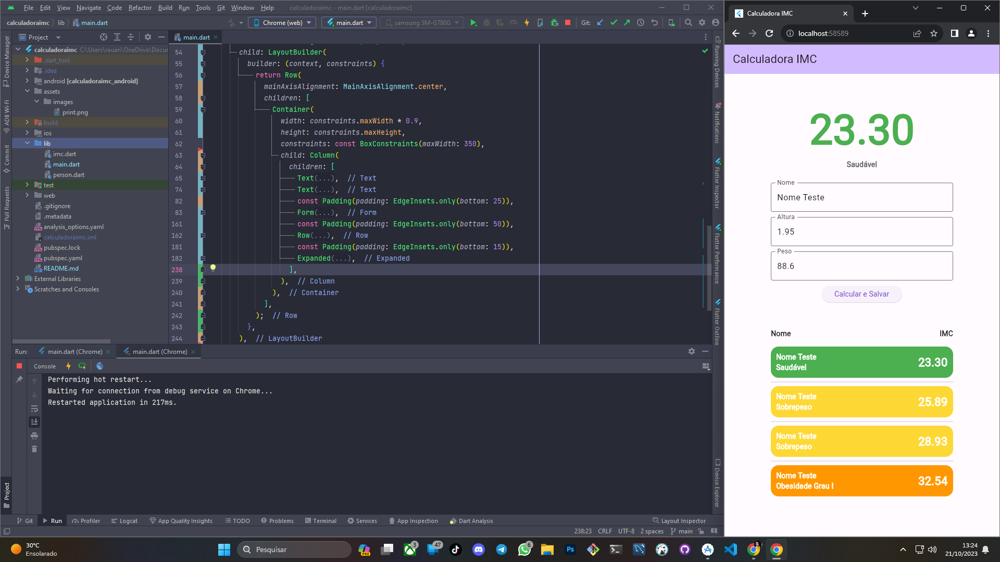

# Desafio DIO.

## Primeira Parte

Calculadora simples para calcular o IMC (Índice de Massa Corporal) de uma pessoa utilizando a linguagem 
Dart e o Flutter.

 

## Segunda Parte

Aprimorando calculadora de IMC, adicionando classe IMC para atuar em conjunto com a classe Person. 
A classe IMC calcula no próprio construtor, adicionei um ListView para apresentar o histórico de cálculos, 
utilizando uma lista de instâncias da classe Person com a classe IMC atribuída internamente.

 